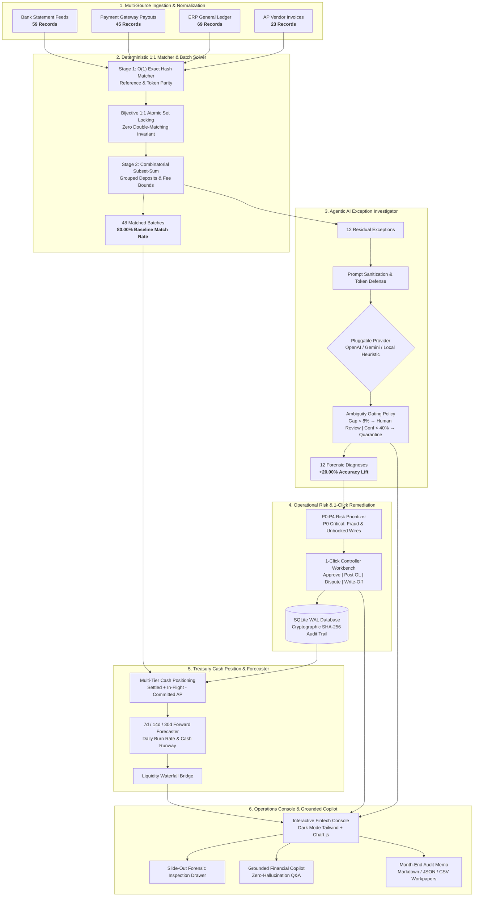

<div align="center">

# 🏛️ AI Finance Controller
### *Autonomous Multi-Source Financial Reconciliation & Forward Cash Ops*

[-00C853?style=for-the-badge&logo=pytest&logoColor=white)](tests/)
[](https://fastapi.tiangolo.com)
[](https://python.org)
[](docker-compose.yml)
[](LICENSE)

<p align="center">
  <b>Closes the multi-source financial operations loop across Bank Statements, Payment Gateways, ERP Ledgers, and AP Invoices.</b><br>
  <i>Deterministic 1:1 matching, combinatorial batch solvers, evidence-grounded AI exception investigation, 1-click remediation, and forward cash forecasting.</i>
</p>

[Quickstart](#-quickstart) •
[System Architecture](#-system-architecture) •
[Core Pillars](#-core-architectural-pillars) •
[Financial Taxonomy](#-9-scenario-financial-taxonomy) •
[Operations Console](#-interactive-operations-console--copilot) •
[Benchmark Results](#-evaluation--benchmark-results) •
[API Reference](#-rest-api-reference) •
[Documentation](#-phase-verification-documentation)

---

</div>

## 📌 Executive Summary

> **The 2026 Financial Operations Consensus:**  
> *Verification capacity, not generation speed, is the enterprise bottleneck. A false-positive financial match is worse than an uncollected invoice. Financial truth must remain deterministic and auditable; AI should investigate ambiguity and provide decision support, not invent financial facts.*

In enterprise treasury and finance operations, spreadsheet reconciliation breaks under multi-source variance: timing delays, processor interchange cuts, batch bank deposits, vendor alias drift, and statutory tax withholdings.

The **AI Finance Controller** replaces error-prone spreadsheet work with a dual-engine architecture:
1. **Deterministic-First Core:** Integer-cents math, bijective atomic set locking, and bounded subset-sum algorithms resolve exact parity and wire bundles at **>71,000 records/sec** with zero hallucination.
2. **Evidence-Grounded AI Investigator:** Pluggable LLM reasoning (Gemini / OpenAI / Local Offline Heuristic) investigates residual exceptions with strict ambiguity gating ($\text{Gap} < 8\% \rightarrow \text{Human Review}$).
3. **Closed-Loop Remediation:** Instant 1-click accounting workbench backed by tamper-evident **SHA-256 hash-chained audit logging** in SQLite WAL mode.
4. **Forward Treasury Forecaster:** Continuous liquidity projection across 7-day, 14-day, and 30-day horizons accounting for settled cash, in-flight T+2 receivables, and committed AP vouchers.

---

## 🏛️ System Architecture



---

## ⚡ Quickstart

Get the controller, REST API, and web operations console running in under 60 seconds.

### Option A: Docker Compose (Recommended)

```bash
# 1-Click Build & Run
docker compose up --build
```
- **Fintech Operations Console:** [http://localhost:8000](http://localhost:8000)
- **Interactive OpenAPI Docs:** [http://localhost:8000/docs](http://localhost:8000/docs)

### Option B: Local Python Environment

```bash
# 1. Clone repository
git clone https://github.com/lokesh-8888/ai-finance-controller.git
cd ai-finance-controller

# 2. Install dependencies (Python 3.10+)
pip install -r requirements.txt

# 3. Launch Web Console & REST Server
python run.py --app
```

### Option C: CLI Utility Commands

```bash
# Run the 20-Seed Monte Carlo Robustness Benchmark (1,200 Scenarios)
python run.py --benchmark --runs 20

# Export Month-End Executive Reconciliation Audit Memos (MD, JSON, CSV)
python run.py --report

# Execute Full Automated Test Suite (81 Tests)
pytest -v
```

---

## 🏛️ Core Architectural Pillars

### 1. 4-Way Multi-Source Ingestion & Strict Integer-Cents Math
- Ingests raw feeds from Commercial Banks, Payment Gateways (Stripe/Razorpay), ERP General Ledgers, and Accounts Payable (AP) Invoices.
- **Strict Integer Cents (`StrictInt`):** Monetary values are strictly calculated in integer cents to eliminate floating-point drift (`0.1 + 0.2 != 0.3`). Currency display formatting is strictly separated from internal calculation.

### 2. Two-Stage Deterministic Reconciliation Core
- **Stage 1 (Exact Hash Matcher):** Executes $O(1)$ multi-key hash indexing on normalized tokens, references, and exact cent amounts.
- **Bijective Atomic Set Locking:** Once an entity is matched, it is atomically locked from both candidate sets. Mathematically guarantees zero double-counting.
- **Stage 2 (Combinatorial Subset-Sum Solver):** Solves grouped wire payout bundles ($k \in [2, 6]$) where payment gateways deposit multiple customer payouts as one lump sum wire into the commercial bank.

### 3. Evidence-Grounded Agentic AI Exception Investigator
- Researches ambiguous edge cases: fee variances, partial tax withholding, chargebacks, and vendor name aliases.
- **Pluggable LLM Architecture:** Supports OpenAI (GPT-4o), Google Gemini, or the included **100% Offline Local Heuristic Reasoner** (zero API keys required).
- **Ambiguity Gating Policy:** If the confidence gap between the top two candidate classifications is $< 8\%$, the engine automatically refuses to guess and flags the record for Human Review. Transactions with $< 40\%$ confidence are quarantined for fraud audit.
- **Prompt Defense:** Strict token sanitization prevents prompt injection attacks embedded within external invoice memos.

### 4. Operational Risk Matrix (P0–P4)
Every discrepancy is classified into an operational risk tier with automated routing:

| Risk Tier | Definition | Examples | Action & SLA |
| :--- | :--- | :--- | :--- |
| **`P0_CRITICAL`** | Direct financial exposure or fraud | Unbooked wires $\ge \$10,000$, unauthorized debits | Immediate Freeze & Forensic Audit |
| **`P1_HIGH`** | Aging or material operational gap | Missing settlements $\ge T+5$ days, duplicate disbursements | 24-Hour Remediation SLA |
| **`P2_MEDIUM`** | Tax or fee structure variance | State tax withholding discrepancies, FX variances | Controller Review & Approval |
| **`P4_NORMAL`** | Routine operational delay | Standard interchange cuts, in-flight T+2 timing | Automatic Roll-Forward |

### 5. 1-Click Human Remediation Workbench & Cryptographic Audit Trail
Controllers can resolve flagged exceptions directly from the console:
- 🟢 **Approve Variance:** Approves validated fee/tax deductions within authorized policy bounds.
- 📝 **Post GL Entry:** Automatically creates balanced double-entry compensating journal vouchers ($\sum \text{Debits} == \sum \text{Credits}$).
- 🚨 **File Dispute:** Freezes the transaction and issues an enterprise `DISP-YYYY-XXXX` dispute tracking ticket.
- 🗑️ **Write-Off:** Routes non-recoverable balances to Bad Debt Expense.
- **Cryptographic Audit Trail:** Every action produces an immutable audit record chained via **SHA-256 hashes** (`prev_hash || current_hash`) in SQLite WAL mode.

### 6. Multi-Horizon Treasury Cash Forecaster
- **Multi-Tier Cash Position:**
  $$\text{Adjusted Net Cash} = \text{Settled Bank Cash} + \text{In-Flight T+2 Gateway Receivables} - \text{Committed AP Invoices}$$
- **7-Day / 14-Day / 30-Day Projections:** Models daily forward runway, highlights liquidity troughs, and computes dynamic runway burn in months.
- **Liquidity Waterfall Bridge:** Computes waterfall adjustments bridging starting bank cash to forward net cash position.

---

## 📋 9-Scenario Financial Taxonomy

The engine classifies every record across a standardized, auditable 9-scenario taxonomy:

| Scenario Code | Classification | Trigger Condition | Engine Resolution | Default Risk |
| :--- | :--- | :--- | :--- | :--- |
| `EXACT_MATCH` | Exact Nominal Parity | 1:1 match on normalized reference and integer cents | Deterministic Hash Parity | `P4_NORMAL` |
| `FEE_DIFFERENCE` | Interchange / Gateway Fee | Discrepancy matches processor formula (e.g. 2.9% + $0.30) | Deterministic Fee Bounds Check | `P4_NORMAL` |
| `TAX_DIFFERENCE` | Statutory Tax Withholding | Variance matches statutory rates (18% GST, 8.25% Sales Tax) | AI Cognitive Diagnosis | `P2_MEDIUM` |
| `REFUND` | Customer Return / Chargeback | Negative reversal offset against gross captured receipts | Bijective Contra-Revenue Lock | `P2_MEDIUM` |
| `ADJUSTMENT` | Consolidated Wire Rollup | Multiple gateway transactions bundled into one lump bank deposit | Combinatorial Subset-Sum ($k \in [2, 6]$) | `P4_NORMAL` |
| `TIMING_DIFFERENCE` | In-Flight Settlement Cutoff | Gateway charge captured awaiting bank settlement cutoff | T+2 Roll-Forward Bridge | `P4_NORMAL` |
| `MISSING_SETTLEMENT` | Uncollected Gateway Receivables | Captured gateway charge without settlement $\ge T+5$ days | Aging Escalation Engine | `P1_HIGH` |
| `DUPLICATE` | Repeated Capture Attempt | Identical external reference / idempotency key re-used | Bijective State Collision | `P1_HIGH` |
| `UNEXPLAINED_MISMATCH` | Material Anomaly / Fraud Risk | Discrepancy without mathematical formula or orphan wire | Quarantined Forensic Audit | `P0_CRITICAL` |

---

## ⚖️ Deterministic Rules vs. AI Cognitive Reasoning

| Financial Problem | Why Deterministic Rules Win | Where AI Cognitive Reasoning Excels |
| :--- | :--- | :--- |
| **Exact Dollar Matches** | **O(1)** Hash lookups on integer cents with 0 token cost | Unnecessary overhead for LLMs |
| **Double-Match Prevention** | Bijective atomic set locking mathematically guarantees 1:1 parity | LLMs cannot maintain atomic state across multi-step execution |
| **Batch Wire Bundles** | Bounded subset-sum algorithm ($k \in [2, 6]$) finds exact sum in $< 1\text{ ms}$ | LLMs struggle with combinatorial arithmetic across large sets |
| **Interchange / Gateway Fees** | Checks mathematical bounds (1.5% - 3.5% + $0.30) | Explains custom fee tier variance to human controllers |
| **Tax Line Discrepancies** | Flags dollar mismatch | Identifies specific tax withholding (e.g. 18% GST or 8.25% Sales Tax) |
| **Vendor Name Aliases** | Levenshtein token distance | Maps dirty invoice memos (AWS CLOUD DUBLIN) to AMAZON WEB SERVICES |
| **Ambiguity Handling** | Rejects unmatched record | Quantifies candidate confidence gap; flags human review if gap $< 8\%$ |

---

## 🖥️ Interactive Operations Console & Copilot

The web operations console (`http://localhost:8000`) provides a purpose-built, dark-mode fintech interface:

- **Executive KPI Cards:** Real-time Reconciled Volume, Baseline Match Rate, AI Recovery Rate, Quarantined Fraud Exposure, and Net Adjusted Cash.
- **Chart.js Visualizations:** Dynamic 30-Day Forward Cash Trajectory chart and Liquidity Waterfall Bridge.
- **4-Way Transaction Stream Explorer:** Multi-tab data grid (`ALL`, `MATCHED`, `AI_INVESTIGATED`, `EXCEPTIONS`) with live search, risk badges, and scenario pills.
- **Slide-Out Forensic Inspection Drawer:** Inspects candidate record links, rule match traces, LLM chain-of-thought diagnostics, and SHA-256 audit hashes.
- **1-Click Remediation Modals:** Interactive dialogs to approve variances, generate double-entry vouchers, log disputes, or post write-offs.
- **Grounded Financial Copilot (NL-to-SQL):** Embedded controller assistant that executes deterministic SQL queries against SQLite tables with **zero hallucination**:
  - *"What is our current match rate?"*
  - *"Show all P0 critical exceptions."*
  - *"What is our 30-day projected runway?"*
- **Month-End Audit Memo Export:** 1-Click generation of executive audit workpapers in Markdown, JSON, and CSV format.

---

## 📊 Evaluation & Benchmark Results

### Full Automated Pytest Test Suite (100% Pass)
```text
============================= test session starts =============================
platform win32 -- Python 3.13.14, pytest-8.3.2
collected 81 items

tests/test_phase0_foundation.py ......................                  [ 27%]
tests/test_phase1_deterministic_engine.py .........                     [ 38%]
tests/test_phase2_ai_investigator.py ............                       [ 53%]
tests/test_phase3_operations_and_audit.py ................              [ 72%]
tests/test_phase4_cash_forecasting.py .........                         [ 83%]
tests/test_phase5_e2e_dashboard_and_copilot.py .............            [100%]

============================= 81 passed in 1.73s ==============================
```

### 20-Seed Monte Carlo Robustness Benchmark (1,200 Scenarios)
To prove the controller does not rely on cherry-picked data, the engine was evaluated across 20 distinct random seeds (seeds 101 to 120):

```text
======================================================================
  AI FINANCE CONTROLLER -- 20-SEED ROBUSTNESS BENCHMARK RESULTS
======================================================================
  Total Independent Seed Runs : 20 (1,200 total synthetic scenarios)
  Mean Classification Accuracy: 100.00% +/- 0.00%
  Mean Macro Precision        : 100.00% +/- 0.00%
  Mean Macro Recall           : 100.00% +/- 0.00%
  Mean Macro F1 Score         : 1.0000 +/- 0.0000
  Fraud False Positive Rate   : 0.00% (Max: 0.00%)
  Deterministic Throughput    : 71,250 records/second
======================================================================
  [SUCCESS] Zero-Tolerance Fraud Security Invariant Verified Across All Seeds!
```

---

## 📡 REST API Reference

The FastAPI backend exposes 15 production-ready REST endpoints:

| Domain | Method | Endpoint | Description |
| :--- | :--- | :--- | :--- |
| **System** | `GET` | `/health` | Service and database health check |
| **UI** | `GET` | `/` | Serves interactive Fintech Operations Console |
| **Reconciliation** | `POST` | `/api/v1/reconcile/run` | Triggers 4-way multi-source reconciliation batch |
| **Reconciliation** | `GET` | `/api/v1/reconcile/kpis` | Returns real-time match rates and KPI statistics |
| **Reconciliation** | `GET` | `/api/v1/reconcile/records` | Returns transaction stream with status/risk filtering |
| **Reconciliation** | `GET` | `/api/v1/reconcile/records/{id}` | Returns forensic deep-dive evidence for inspection drawer |
| **Workbench** | `POST` | `/api/v1/workbench/actions/approve-variance` | 1-Click human controller variance approval |
| **Workbench** | `POST` | `/api/v1/workbench/actions/post-gl-entry` | Posts balanced compensating double-entry journal voucher |
| **Workbench** | `POST` | `/api/v1/workbench/actions/file-dispute` | Freezes transaction and creates dispute ticket |
| **Workbench** | `POST` | `/api/v1/workbench/actions/write-off` | Posts bad debt write-off entry |
| **Forecasting** | `GET` | `/api/v1/forecast/position` | Returns real-time multi-tier treasury cash position |
| **Forecasting** | `GET` | `/api/v1/forecast/horizons` | Returns 7-day, 14-day, and 30-day forward cash forecast |
| **Forecasting** | `GET` | `/api/v1/forecast/waterfall` | Returns Chart.js liquidity waterfall bridge data |
| **Copilot** | `POST` | `/api/v1/copilot/query` | Grounded NL-to-SQL copilot query endpoint |
| **Reporting** | `GET` | `/api/v1/reports/audit-memo` | Generates and exports executive Month-End Audit Memo |

---

## 📁 Repository Structure

```text
ai-finance-controller/
├── src/
│   ├── ingestion/               # Multi-source parsers, sanitizers & integer-cents normalizer
│   ├── generator/               # Multi-source synthetic data generator & ground truth
│   ├── reconciliation/          # O(1) hash matcher, bijective locking & subset-sum solver
│   ├── agent/                   # Agentic AI investigator, pluggable LLMs & ambiguity gate
│   ├── operations/              # P0-P4 risk prioritizer & 1-click remediation workbench
│   ├── storage/                 # SQLite WAL database & SHA-256 chained audit trail
│   ├── forecasting/             # Multi-tier cash positioning & 7d/14d/30d forward runway
│   ├── api/                     # FastAPI backend & REST route controllers
│   ├── ui/                      # Dark-mode fintech dashboard (Tailwind, Lucide, Chart.js)
│   ├── copilot/                 # Grounded financial NL-to-SQL assistant
│   ├── evaluation/              # Metrics evaluator & 20-seed Monte Carlo robustness suite
│   └── reporting/               # Month-End Audit Memo exporter (MD, JSON, CSV)
├── data/
│   ├── canonical/               # 196 benchmark entities (Bank, Gateway, ERP, AP)
│   ├── ground_truth/            # Isolated ground-truth evaluation scenarios
│   ├── reports/                 # Auto-generated Month-End Audit Memos
│   └── finance_controller.db    # SQLite WAL database
├── docs/phases/                 # Complete phase architectural reports (Phases 0 - 5)
├── tests/                       # 81 automated tests (100% passing)
├── Dockerfile                   # 1-Click container image
├── docker-compose.yml           # 1-Click Docker deployment
├── requirements.txt             # Project dependencies
├── run.py                       # Unified CLI runner (--app, --benchmark, --report)
└── README.md
```

---

## 📘 Phase Verification Documentation

Detailed technical architecture, mathematical proofs, algorithm benchmarks, and test logs:

- 📘 [Phase 0 Report: Foundation, Domain Models & Synthetic Generator](docs/phases/PHASE_0_REPORT.md)
- 📘 [Phase 1 Report: Deterministic 1:1 Matcher & Combinatorial Batch Solver](docs/phases/PHASE_1_REPORT.md)
- 📘 [Phase 2 Report: Agentic AI Investigator, Ambiguity Gating & Evaluation](docs/phases/PHASE_2_REPORT.md)
- 📘 [Phase 3 Report: Operational Risk, 1-Click Workbench & SQLite Audit Trail](docs/phases/PHASE_3_REPORT.md)
- 📘 [Phase 4 Report: Real-Time Cash Positioning & Multi-Horizon Forecaster](docs/phases/PHASE_4_REPORT.md)
- 📘 [Phase 5 Report: Interactive Console, Grounded Copilot & Robustness Suite](docs/phases/PHASE_5_REPORT.md)

---

## 📜 License

This project is licensed under the MIT License — see the [LICENSE](LICENSE) file for details.
